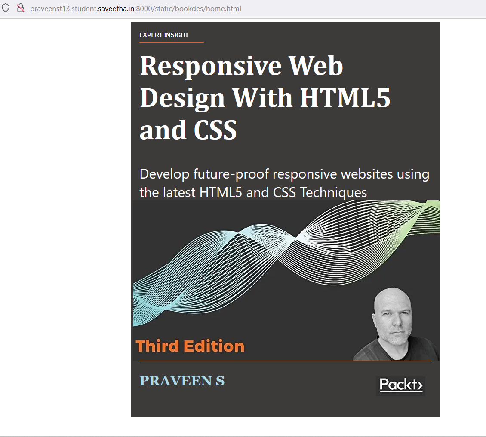

# cover-page-design
## AIM:
To develop a website to display the cover page design of a book

## Design Steps:

### Step 1:
Write your own steps here.
### Step 2:

## Code:
```
<!DOCTYPE html>
<html lang="en">
    <head>
         <meta name="viewport" 
         content="width=device-width, initial-scale=1.0">
         <style>
     
        .bookpage{
            width: 680px;
            height: 880px;
            background-color: #3d3a3a;
            color:white;
            margin-left: auto;
            margin-right: auto;
            padding: 20px;
            font-family: 'Franklin Gothic Medium', 'Arial Narrow', Arial, sans-serif;
          
        }
            

        .toptext{
            top: 1px;
            color:white;
           
        }

        
        .line1{
            top: 2px;
            width: 150px;
            color: orangered;
        }
        .name{
            color: white;
            display: inline;
            position: relative;
            color:lightblue;
            top:230px;
            
            font-family:Georgia;
            font-size: xx-large;
        }
        .booktitle{
            font-family:Cambria, Cochin, Georgia, Times, 'Times New Roman', serif;
            font-size: xx-large;
            text-align: left;
            position: relative;
            top: -30.0px;
        
        }
        .line2 {
            width: auto;
            position:relative;
            
            top:235px;
            
        }
        .publisher{
            font-size: medium;
            position: relative;
            top: 170px;
            left:550px;
        }
        
        .sub{
            font-family:'Segoe UI', Tahoma, Geneva, Verdana, sans-serif;
            font-size:xx-large;
            position: relative;
            top:-30px;
        }
        .img{
            
            position: relative;
            top: -30px;
            left: -15px;
            width: 100px;
            height: 100px;
            
            
        }
        </style>
        <title>Book Cover Page</title>
    </head>
    <body>
        <div class="bookpage">
            <div class="toptext">
                EXPERT INSIGHT
            </div>
            <div class="line1">
                <hr style="color: rgb(255, 84, 22);">
            </div>
            <div class="booktitle">
                <h1>Responsive Web Design With HTML5 and CSS</h1></div>
            <div class="sub">
                Develop future-proof responsive websites using the latest HTML5 and CSS Techniques
            </div>
            <div class="img">
             
            </div>
            <div class="line2">
                <hr style="color: rgb(255, 123, 0);" >
            </div>
            <div class="name">
               <p><b>PRAVEEN S</b></p>
            </div>
            <div class="publisher">
                
            </div>
           
            
        </div>
    </body>
</html>
```

## Output:


## Result:

The program for designing cover-page-design using HTML and CSS is executed successfully.
